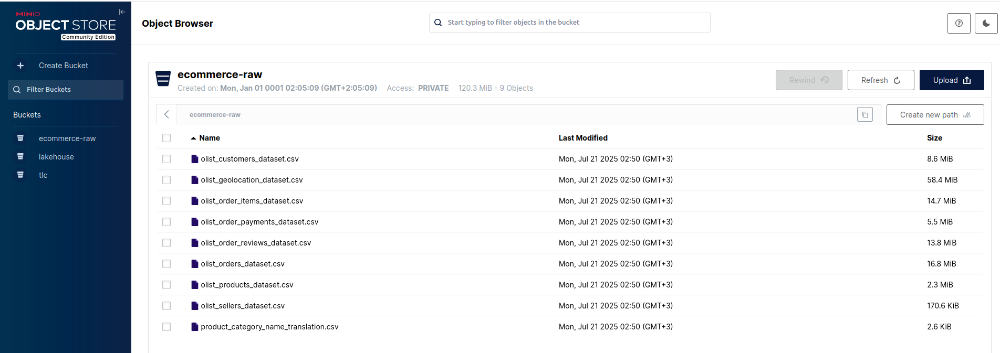
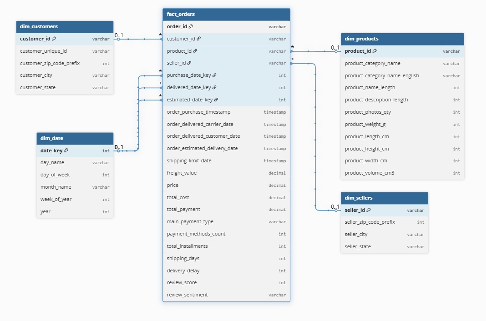
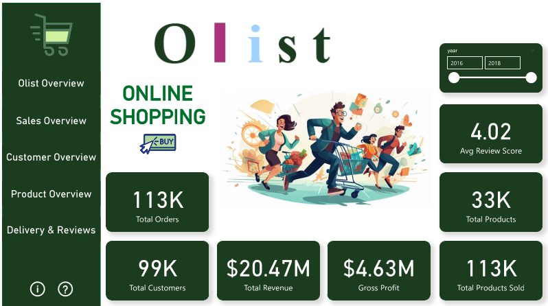
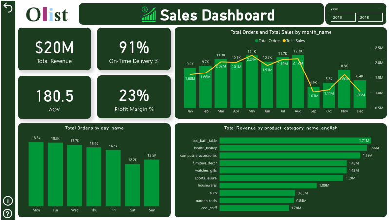
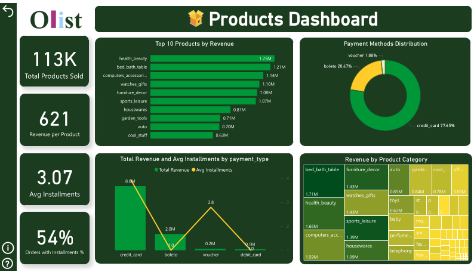
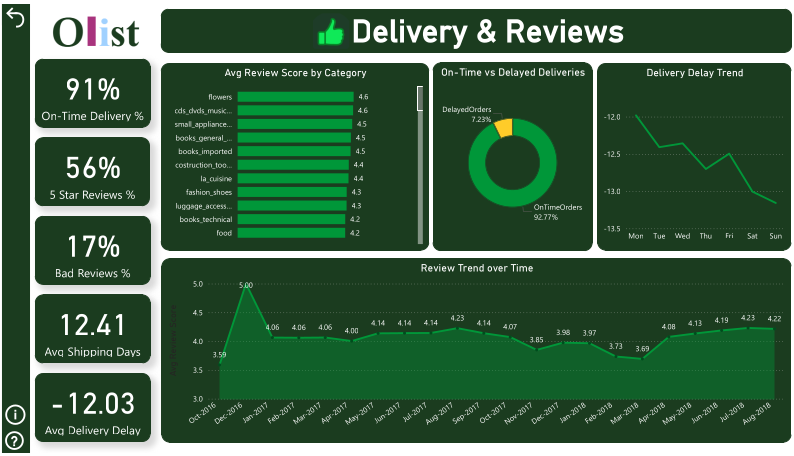

# 🚀 Brazilian E-Commerce Data Pipeline (End-to-End)

## 🌟 Overview

Build a fully-automated **Data Engineering + BI Analytics End-to-End pipeline** powered by modern open-source tools like **Apache Spark**, **MinIO**, **Postgres**, **Apache Airflow**, and **Power BI**.

It ingests real-world e-commerce data from Kaggle and turns it into clean, modeled insights ready for BI dashboards — all containerized with Docker.

🎯 **Goal**: From raw CSVs → Spark ETL → star schema on Postgres → rich analytics → interactive dashboards.

---

## 🧱 Architecture

> End-to-End pipeline from ingestion to orchestration to visualization  
  

---

## 🪣 MinIO (Data Lake Layer)

MinIO acts as the **data lake layer** in this pipeline. All raw CSV files from the Kaggle dataset are first uploaded to MinIO. This ensures:
- Centralized **raw data storage** (object storage like Amazon S3).
- Easy scalability for larger datasets.
- Spark can directly read data from MinIO for further processing.

This step separates **raw data ingestion** from **data transformation**, providing a clean staging layer.



---

## 🧬 Data Modeling

> Modeled using a **Star Schema** in Apache Spark

- **Fact Table**: `fact_orders`  
- **Dimension Tables**:  
  - `dim_customers`  
  - `dim_products`  
  - `dim_sellers`  
  - `dim_geolocation`  
  - `dim_date`  

  

---

## ⚙️ Workflow Orchestration with Airflow

We automated the ETL process using **Apache Airflow**:

- **Task 1** → Initialize PostgreSQL DWH (`olist_dwh`) if it doesn’t exist.  
- **Task 2** → Execute Spark ETL Notebook via **Papermill** to process and load data.  

This ensures reproducibility, scheduling, and monitoring of the entire pipeline.

---

## 📊 Power BI Dashboard

> Bringing the data to life through rich visualizations  

### Key Insights (5 Pages):

- 🖼️ **Olis Overview** → Design & KPIs Overview  
- 📈 **Sales Overview** → Revenue trends, top categories, payment methods, revenue by state  
- 👥 **Customers & Sellers** → Customer vs seller distribution, orders by state, revenue by seller state  
- 🛒 **Products & Payments** → Revenue by product category, top 10 products, payment methods & installments  
- 🚚 **Delivery & Reviews** → Shipping performance, delivery delays, on-time vs delayed orders, customer reviews over time  

  
  
  
  

---

## 🔄 ETL Pipeline: Step-by-Step

1. **Ingest** raw CSV files from [Kaggle Dataset](https://www.kaggle.com/datasets/olistbr/brazilian-ecommerce) into **MinIO**.  
2. **Apache Spark**:  
   - Reads and cleans raw data  
   - Handles missing values, invalid records, and standardizes categories/cities  
   - Enriches products with translations and derived fields (volume, size category, etc.)  
   - Builds a **Star Schema** (fact + dimension tables).  
3. **Airflow DAG** orchestrates the workflow:  
   - Ensures `olist_dwh` exists in Postgres  
   - Executes Spark ETL job  
4. **Load** processed data into **Postgres DWH**.  
5. **Power BI** connects to Postgres for dashboards and reporting.  

---

## 🛠️ Tech Stack

| Tool              | Role                          |
| ----------------- | ----------------------------- |
| 🐳 Docker Compose | Container orchestration       |
| 🪣 MinIO          | Object storage (raw files)    |
| ⚡ Apache Spark   | ETL + data modeling engine    |
| 🐘 Postgres       | Data Warehouse (Star Schema)  |
| 🌀 Apache Airflow | Workflow orchestration (DAGs) |
| 📊 Power BI       | Dashboard & reporting         |

---

## 🚀 How to Run It Locally

> Make sure you have **Docker & Docker Compose** installed.

```bash
# Start all services (Postgres, MinIO, Spark, Airflow)
docker compose up -d

# Open Airflow UI:
http://localhost:8080

# Access MinIO:
http://localhost:9000

# Connect to Postgres:
localhost:5432  (user/password as in docker-compose)

# Load data into Power BI:
Connect → PostgreSQL → Enter server & database
```

---

## 🙏 Credits

- 📦 Dataset: [Brazilian E-Commerce - Kaggle](https://www.kaggle.com/datasets/olistbr/brazilian-ecommerce)  
- 🖼️ Icons & Logos: Official branding of respective tools  
- 📊 Dashboard: Designed for actionable business insights using Power BI  

---

🚀 Project delivered end-to-end with **Data Engineering + BI Analytics excellence**  

👨‍💻 Created by [Ahmed Rabie](https://www.linkedin.com/in/ahmed-m-rabie-0ba5b120b/)

